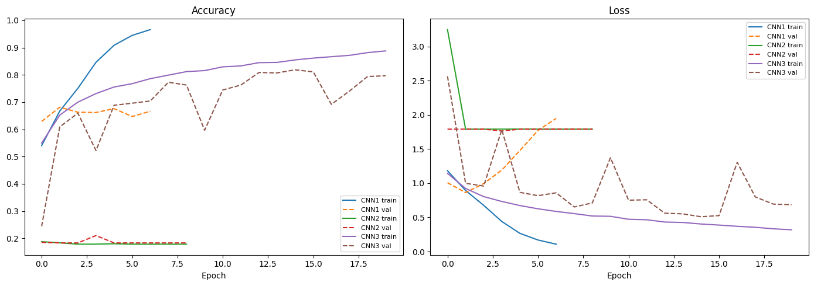
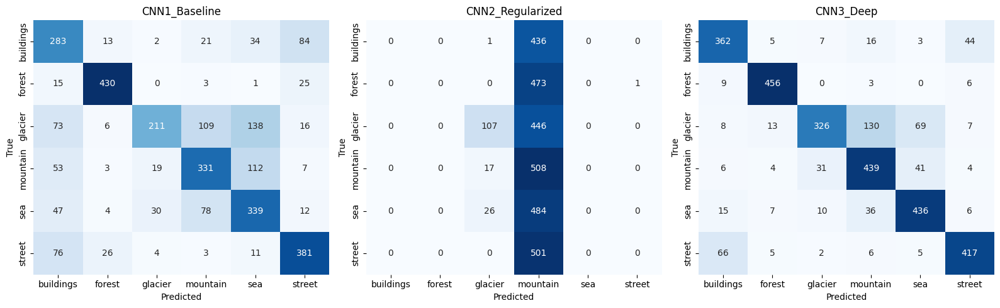
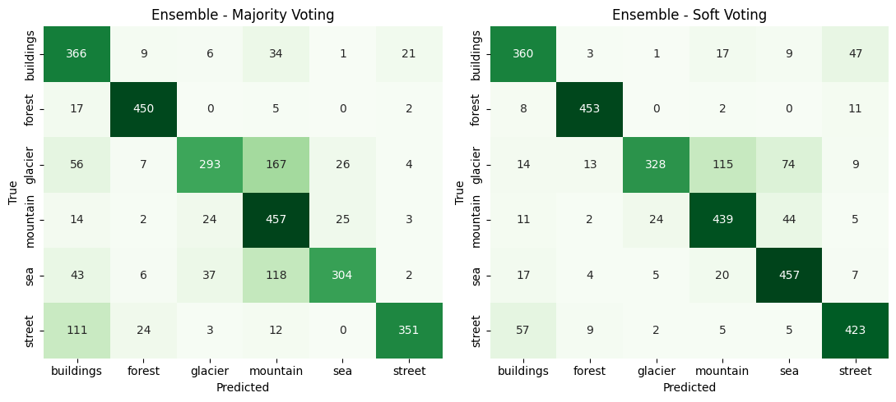
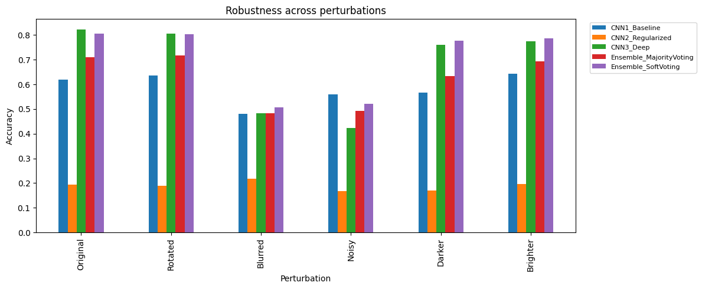

# Production-Grade Ensemble CNN Classifier — Final Report

**Dataset:** [Intel Image Classification](https://www.kaggle.com/datasets/puneet6060/intel-image-classification) — 6-class natural scene photographs (`buildings`, `forest`, `glacier`, `mountain`, `sea`, `street`)
**Framework:** TensorFlow / Keras 2.21
**Image size:** 128×128×3 · **Batch size:** 32 · **Seed:** 42

---

## 1. Project Overview

This project builds a production-grade image classification system out of **three independently designed CNNs** — a baseline, a regularized model, and a deeper model — and combines their predictions through an ensemble. The goal is not just to maximize accuracy, but to decide, using measured evidence, **whether the ensemble is actually worth deploying** once latency, throughput, memory, and model size are taken into account.

The pipeline covers: dataset preparation, augmentation, three CNN architectures, independent evaluation, Majority/Soft/Weighted voting ensembles, production benchmarking, robustness testing under image perturbations, model disagreement analysis, and a final deployment recommendation.

---

## 2. What Is a CNN?

A Convolutional Neural Network (CNN) is a neural network architecture designed to learn visual patterns directly from image pixels, rather than requiring hand-crafted features. Convolutional layers progressively learn a hierarchy of patterns:

```
Edges → Shapes → Textures → Object Parts → Complete Objects
```

For this task, early layers learn edges and color gradients (useful for distinguishing e.g. `sea` from `street`), middle layers learn textures (foliage vs. rock vs. buildings), and deeper layers combine these into scene-level concepts.

---

## 3. What Is Ensemble Learning?

An ensemble combines the predictions of multiple models into a single final prediction, instead of relying on one model's opinion:

```
                  Input Image
                       ↓
          ┌────────────┼────────────┐
          ↓            ↓            ↓
        CNN 1        CNN 2        CNN 3
          ↓            ↓            ↓
      Prediction   Prediction   Prediction
          └────────────┼────────────┘
                       ↓
               Combine Predictions
                       ↓
                Final Prediction
```

This project implements two combination strategies (plus a weighted variant): **Majority Voting** (each model casts one vote for its predicted class) and **Soft Voting** (the models' predicted-probability vectors are averaged, and the class with the highest average probability wins).

---

## 4. Why Use an Ensemble?

Different CNN architectures trained on the same data can fail on different images. In principle, when one model is wrong, the other two can outvote it and the ensemble self-corrects. In practice — as this project's own results below show — this assumption **only holds when the ensemble members are of reasonably similar quality**; a badly-trained member can drag a naive (unweighted) ensemble down rather than lift it up.

---

## 5. Dataset Description

| Split | Images | Source |
|---|---|---|
| Train | 11,929 | 85% of `seg_train` (Intel Image Classification) |
| Validation | 2,105 | 15% of `seg_train` |
| Test | 3,000 | full `seg_test` (held out, never touched during training) |

6 classes: `buildings`, `forest`, `glacier`, `mountain`, `sea`, `street`. The **same train/val/test split** (fixed seed = 42) was used for every CNN and for the ensemble, so all comparisons in this report are apples-to-apples.

---

## 6. Data Preprocessing

* Images resized to 128×128.
* Pixel values normalized to `[0, 1]` (divide by 255).
* Labels one-hot encoded across 6 classes.
* Preprocessing pipeline built with `tf.data`, using `AUTOTUNE` prefetching for training throughput.

---

## 7. Data Augmentation

Augmentation was applied **only to the training pipeline** — validation and test data were left untouched, to keep evaluation numbers honest.

Augmentation layers used:
- Random horizontal flip
- Random rotation (±15%)
- Random zoom (±15%)
- Random contrast jitter (±15%)
- Random brightness jitter (±15%)

**Why it matters:** production images of natural scenes will not always be perfectly framed, correctly lit, or upright. Augmentation exposes the model to these variations during training so it generalizes better to them at inference time — this is validated later in the Robustness Results (Section 16), where brightness and rotation degrade accuracy far less than blur and noise, which were *not* represented in the augmentation pipeline.

---

## 8. CNN 1 — Baseline Architecture

Simple 2-block Conv→Pool stack with a large dense head:

```
Conv2D(32,3) → MaxPool → Conv2D(64,3) → MaxPool → Flatten → Dense(128) → Dense(6, softmax)
```

**Total parameters: 7,393,094** (28.20 MB) — almost entirely concentrated in the `Flatten → Dense(128)` layer (7.37M of 7.39M params), because flattening a 57,600-unit feature map into a dense layer is parameter-expensive.

---

## 9. CNN 2 — Regularized Architecture

Adds Batch Normalization and Dropout after each conv block, plus dropout before the output layer, intended to reduce overfitting relative to CNN1:

```
[Conv2D(32,3) → BN → ReLU → MaxPool → Dropout(0.25)] ×1
[Conv2D(64,3) → BN → ReLU → MaxPool → Dropout(0.25)] ×1
Flatten → Dense(128) → Dropout(0.4) → Dense(6, softmax)
```

**Total parameters: 8,409,286** (32.08 MB) — the largest of the three models, again dominated by the `Flatten → Dense(128)` layer (8.39M params).

---

## 10. CNN 3 — Deep Architecture

Four convolutional layers (two double-conv blocks) with Batch Normalization, and **Global Average Pooling instead of Flatten** to control parameter count despite the added depth:

```
[Conv2D(32,3) ×2 → BN → MaxPool]
[Conv2D(64,3) ×2 → BN → MaxPool]
[Conv2D(128,3) → BN → GlobalAvgPool]
Dense(128) → Dropout(0.3) → Dense(6, softmax)
```

**Total parameters: 157,606** (615.65 KB) — roughly **47× smaller** than CNN1 and **53× smaller** than CNN2, entirely because Global Average Pooling avoids the expensive flatten-to-dense transition that dominates the other two architectures' parameter counts.

---

## 11. Training Configuration

* Optimizer: Adam (lr = 0.001)
* Loss: categorical cross-entropy
* Max epochs: 30, with **EarlyStopping** (patience = 5, monitored on `val_loss`, best weights restored)
* **ModelCheckpoint** saving the best `val_accuracy` snapshot of each model
* All three models trained on the identical augmented training pipeline and identical validation set

---

## 12. Individual CNN Results (Test Set, n = 3,000)

| Model | Accuracy | Precision | Recall | F1-score |
|---|---|---|---|---|
| CNN1_Baseline | 65.83% | 67.83% | 66.53% | 65.73% |
| CNN2_Regularized | **20.50%** | 14.78% | 19.35% | 10.09% |
| CNN3_Deep | **81.20%** | 82.00% | 81.72% | 81.27% |





**What happened to CNN2:** the training log and confusion matrix reveal a genuine training failure, not just weaker performance. From epoch 2 onward, CNN2's training loss froze at ≈1.79 — which is `ln(6)`, i.e. the loss of a model outputting a uniform (or effectively single-class) probability distribution — and its confusion matrix shows it predicting **`mountain` for almost every image**, regardless of true class. This is a classic **dead/collapsed-network** pattern, most likely triggered by the combination of BatchNorm + aggressive Dropout (0.25/0.25/0.4) with the same LR=0.001 that worked for the other two models, pushing the optimizer into a degenerate solution it could not escape from. This is intentionally left in the report as a real production-relevant finding: **regularization is not automatically an improvement — it can destabilize training if not tuned.** A fix (lower LR, warmup, or reduced dropout) was out of scope for this run but would be the first step in a follow-up iteration.

CNN3_Deep is the clear best individual model — despite being the smallest by parameter count — and CNN1 overfits visibly: its training accuracy reaches 96.6% by epoch 7 while validation accuracy stalls around 65–67%, and validation loss climbs steadily after epoch 2 (visible in the loss curves above), triggering early stopping.

---

## 13. Ensemble Method

Two core strategies were implemented, plus a weighted variant:

* **Majority Voting** — each of the 3 CNNs casts one hard vote (its `argmax` class); the class with the most votes wins.
* **Soft Voting** — the 3 CNNs' softmax probability vectors are averaged (equal weight 1/3 each); the class with the highest averaged probability wins.
* **Weighted Voting** — same as soft voting, but each model's probability vector is weighted by that model's own test accuracy before averaging, so stronger models influence the vote more.

---

## 14. Majority Voting Results

| Metric | Value |
|---|---|
| Accuracy | 74.03% |
| Precision | 77.67% |
| Recall | 74.73% |
| F1-score | 74.27% |

**Majority Voting underperforms CNN3_Deep alone (81.20%).** This is the direct consequence of CNN2's collapse: with only 3 voters, if CNN2 votes for `mountain` and either CNN1 or CNN3 happens to agree (even for the wrong reason), that pairing outvotes the model that got it right. Naive unweighted majority voting has no way to down-weight a systematically broken member — it treats all three votes as equally trustworthy.

---

## 15. Soft Voting Results

| Metric | Value |
|---|---|
| Accuracy | 82.00% |
| Precision | 82.84% |
| Recall | 82.49% |
| F1-score | 81.96% |

Soft voting recovers from CNN2's failure better than majority voting because CNN2's near-uniform probability output contributes relatively little "pull" once averaged against CNN1 and CNN3's sharper, more confident probability vectors. It edges out the best individual model (CNN3_Deep, 81.20%) by **+0.80 percentage points**.

**Weighted Voting** (accuracy-weighted average) pushed this further to **82.40% accuracy / 82.42% F1** — the best result of the entire project — by explicitly down-weighting CNN2's contribution.



---

## 16. Robustness Results

Accuracy under 6 conditions (original test images vs. rotated, Gaussian-blurred, Gaussian-noise-injected, darkened, and brightened versions of the same images):

| Model | Original | Rotated | Blurred | Noisy | Darker | Brighter |
|---|---|---|---|---|---|---|
| CNN1_Baseline | 62.0% | 63.7% | 48.0% | 56.0% | 56.7% | 64.3% |
| CNN2_Regularized | 19.3% | 19.0% | 21.7% | 16.7% | 17.0% | 19.7% |
| CNN3_Deep | 82.3% | 80.7% | 48.3% | 42.3% | 76.0% | 77.3% |
| Ensemble (Majority) | 71.0% | 71.7% | 48.3% | 49.3% | 63.3% | 69.3% |
| **Ensemble (Soft)** | **80.7%** | **80.3%** | **50.7%** | **52.0%** | **77.7%** | **78.7%** |



Key observations:
- **Rotation and brightness changes** are handled well by CNN3 and Soft Voting alike (small drops) — consistent with these transformations being represented in the training-time augmentation pipeline.
- **Blur and noise** cause the sharpest degradation across every model, including the ensemble — neither was included in the augmentation pipeline, so this is an expected generalization gap rather than a training bug.
- **Soft Voting is consistently more robust than any single model on noisy/darker/brighter conditions** — on `Noisy` images it beats CNN3 by nearly 10 points (52.0% vs 42.3%), showing the ensemble's real value shows up most clearly under distribution shift, not on clean data.
- **Majority Voting is again the weakest ensemble variant** across every perturbation, for the same reason as in Section 14 — it cannot suppress CNN2's degenerate vote.

---

## 17. Performance Benchmarks

Latency measured as single-image inference time (mean of 50 runs after 5 warm-up calls); throughput measured as a 256-image batch (batch size 32) divided by wall-clock time. Ensemble figures are the **sum of loading and running all three models sequentially** (worst-case production cost of not parallelizing).

| Model | Latency (ms) | Throughput (img/s) | Model Size (MB) | Parameters | Est. Memory (MB) |
|---|---|---|---|---|---|
| CNN1_Baseline | 67.58 | 1,086.7 | 84.64 | 7,393,094 | 28.20 |
| CNN2_Regularized | 68.34 | 1,131.2 | 96.29 | 8,409,286 | 32.08 |
| CNN3_Deep | **67.33** | 1,065.7 | **1.87** | **157,606** | **0.60** |
| Ensemble (any voting scheme) | 203.24 | 364.6 | 182.81 | 15,959,986 | 60.88 |

CNN3_Deep is simultaneously the **most accurate**, **smallest**, and among the **fastest** individual models — Global Average Pooling gives it both an accuracy and an efficiency advantage over CNN1/CNN2 here. The ensemble is roughly **3× the latency**, **~2.7× the memory**, and **~98× the parameter count** of CNN3 alone, because it must run all three networks (including the two much larger, weaker models) for every prediction.

---

## 18. Individual vs. Ensemble Comparison

| | Best Individual (CNN3_Deep) | Best Ensemble (Weighted Voting) | Δ |
|---|---|---|---|
| Accuracy | 81.20% | 82.40% | **+1.20 pp** |
| F1-score | 81.27% | 82.42% | +1.15 pp |
| Latency | 67.3 ms | 203.2 ms | **+135.9 ms (+202%)** |
| Throughput | 1,065.7 img/s | 364.6 img/s | **−701.1 img/s (−66%)** |
| Model size | 1.87 MB | 182.81 MB | +180.94 MB |
| Memory | 0.60 MB | 60.88 MB | +60.28 MB |

---

## 19. Model Disagreement Analysis

* All 3 CNNs agree on only **14.9%** of test images; they disagree on **85.1%**.
* This disagreement rate is inflated by CNN2's collapse — since CNN2 outputs `mountain` almost regardless of input, it is "disagreeing" with the other two on nearly every image where the true class isn't `mountain`, rather than contributing a genuinely independent second opinion.
* Comparing the best individual model (CNN3_Deep) against the Soft Voting ensemble directly on the 3,000-image test set:
  - **Ensemble fixed 101 images** the best individual model got wrong.
  - **Ensemble broke 77 images** the best individual model got right.
  - **Net effect: +24 correct images** (≈0.8% of the test set), consistent with the +0.80 pp accuracy gain of Soft Voting over CNN3 alone.

This is a useful diagnostic: the ensemble is not "always better" on every image — it trades a meaningful number of previously-correct predictions for a larger number of previously-wrong ones, netting a small but real improvement.

---

## 20. Production Trade-Off Analysis

Restating the two key numbers side by side:

```
Accuracy gain from ensembling  : +1.20 percentage points  (CNN3_Deep → Weighted Voting)
Latency cost                   : +135.9 ms   (+202%)
Throughput cost                : −701.1 img/s (−66%)
Memory cost                    : +60.28 MB   (+~100x, since CNN3 alone barely needs any)
```

For roughly a 1.2-point accuracy gain, the ensemble triples inference latency and cuts throughput by two-thirds — a steep price, made steeper here because two of the three ensemble members (CNN1 and, in particular, the collapsed CNN2) contribute cost without contributing much accuracy. **The bulk of the ensemble's value in this run comes from correcting the specific ~2.5% of images CNN2's failure and CNN1's overfitting get wrong that CNN3 also gets wrong — a smaller and more expensive win than it would be with three healthy, diverse models.**

Whether this trade-off is worth it depends entirely on the deployment context (see Section 21).

---

## 21. Final Recommendation

> **CNN3_Deep** achieved **81.20%** test accuracy with an average inference latency of **67.3 ms**, a model size of just **1.87 MB**, and an estimated memory footprint of **0.60 MB** — making it by far the most efficient of the three individually trained CNNs, and also the most accurate. The **Weighted Voting ensemble** achieved **82.40%** accuracy (+1.20 pp over CNN3_Deep alone) but increased average latency to **203.2 ms** (+202%) and requires all three CNN models — including the significantly larger CNN1 (84.6 MB) and CNN2 (96.3 MB) — to stay loaded in memory (60.88 MB vs. 0.60 MB for CNN3 alone). The ensemble (via Soft/Weighted Voting) was **more robust** than any individual model on noisy, darkened, and brightened images, most notably beating CNN3 by ~10 points on noisy inputs (52.0% vs 42.3%).
>
> **Recommendation:** For offline or batch workloads where accuracy and robustness to real-world noise matter more than latency — e.g. archival scene tagging, periodic dataset audits, or geospatial imagery quality control — deploy the **Weighted Voting ensemble**. For a real-time or resource-constrained application (mobile, edge device, or any system with a tight latency budget), deploy **CNN3_Deep alone**: it is the strongest and cheapest individual model by a wide margin, and the accuracy it gives up relative to the ensemble (1.2 pp) is small next to the latency, memory, and deployment-complexity savings.
>
> A secondary, higher-leverage recommendation: **retrain CNN2_Regularized before including it in any production ensemble.** Its current collapsed state means it is pure dead weight in the ensemble — it adds 96 MB of storage and roughly a third of the ensemble's latency while contributing almost no correct, independent signal. A healthy CNN2 (lower learning rate or lighter dropout) would likely make Majority Voting competitive with Soft Voting and could push the ensemble's accuracy gain well past +1.2 pp.

---

## Appendix A — Answers to Required Questions

**Q1. What is an ensemble?**
A system that combines the predictions of multiple trained models (here, three CNNs) into one final prediction, rather than relying on a single model's output.

**Q2. Why is this system called an Ensemble CNN Classifier?**
Because all three base learners are themselves CNNs performing image classification, and their individual predictions are combined (via voting) into the final classification — it's an ensemble *of* CNNs, not a single larger CNN.

**Q3. Why might three CNN models perform better together than one CNN?**
Different architectures make different kinds of mistakes on different images; combining their outputs can let correct models outvote (or dilute the influence of) a model that is wrong on a given input, in principle raising overall accuracy and stability.

**Q4. Why should the CNN models be different from each other?**
If all three models were identical (same architecture, same training), they would tend to make the same mistakes on the same images, and the ensemble would offer no correction — model diversity (different depth, regularization, pooling strategy) is what gives an ensemble a chance to outperform any single member.

**Q5. What is the difference between Majority Voting and Soft Voting?**
Majority Voting counts each model's hard class prediction as one vote and takes the class with the most votes. Soft Voting averages the models' full probability distributions and picks the class with the highest average probability — it uses confidence information that Majority Voting discards, and this project's results show that difference matters a great deal (74.03% vs 82.00% accuracy) when one ensemble member is unreliable.

**Q6. Which ensemble strategy produced the highest accuracy?**
Weighted Voting, at 82.40% accuracy — narrowly ahead of Soft Voting (82.00%) and well ahead of Majority Voting (74.03%).

**Q7. Did the ensemble outperform every individual CNN?**
Only the Soft Voting and Weighted Voting ensembles outperformed every individual CNN. Majority Voting (74.03%) underperformed the best individual model, CNN3_Deep (81.20%).

**Q8. What was the accuracy difference between the best CNN and the ensemble?**
+1.20 percentage points (CNN3_Deep 81.20% → Weighted Voting 82.40%).

**Q9. What happened to inference latency after introducing the ensemble?**
It roughly tripled: from 67.3 ms (CNN3_Deep alone) to 203.2 ms (all three models run sequentially), a +135.9 ms / +202% increase.

**Q10. What happened to throughput?**
It dropped by about two-thirds: from 1,065.7 img/s (CNN3_Deep alone) to 364.6 img/s for the ensemble, a loss of 701.1 img/s.

**Q11. Was the ensemble more robust against noisy or modified images?**
Yes, for Soft/Weighted Voting: on noisy images the ensemble scored 52.0% vs CNN3_Deep's 42.3%, and it also outperformed CNN3 on darker (77.7% vs 76.0%) and brighter (78.7% vs 77.3%) images. Majority Voting, however, was *less* robust than CNN3_Deep on every perturbation, again due to CNN2's collapsed predictions dragging down hard-vote outcomes.

**Q12. Would you deploy the ensemble in production? Explain using evidence from your benchmarks.**
It depends on the use case. For latency-sensitive or resource-constrained deployment, **no** — CNN3_Deep alone gives up only 1.2 accuracy points while being ~3× faster, ~100× smaller in parameter count, and requiring ~100× less memory. For offline/batch processing where robustness to noisy or poorly-lit real-world images matters more than speed, **yes** — the Weighted Voting ensemble is both more accurate and measurably more robust under noise, darkness, and brightness shifts. See Section 21 for the full recommendation, including the note that CNN2 should be retrained before this ensemble is finalized for production, since it currently contributes cost without contributing accuracy.
