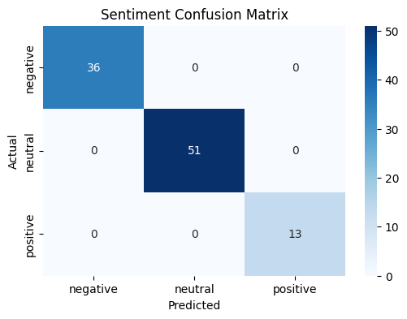
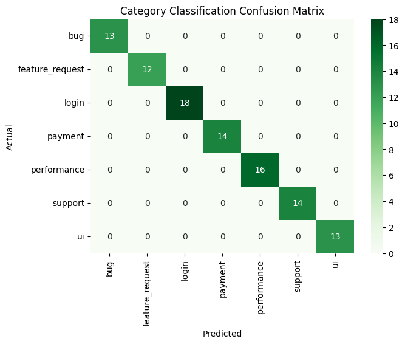

# Customer Feedback Analysis Project

## 📌 Overview
This project analyzes customer feedback using **Natural Language Processing (NLP)** techniques.  
It performs:
- Text preprocessing (cleaning, tokenization, stopword removal, stemming, lemmatization)
- Feature extraction using **TF-IDF**
- Sentiment classification (Positive / Negative / Neutral)
- Category classification (Payment, Login, Performance, Support, UI, Bug, Feature Request)
- Model saving/loading for deployment
- Visualization of evaluation metrics (confusion matrices, classification reports)

---

## 📂 Project Structure
```
Dataset/
 └── feedback_dataset.csv
Models/
 ├── sentiment_model.pkl
 ├── category_model.pkl
 └── tfidf_vectorizer.pkl
Notebooks/
 └── Customer_feedback_analysis_notebook.ipynb
Outputs_Graphs/
 ├── sentiment_classification_confusion_matrix.png
 └── category_classification_confusion_matrix.png
```

---

## 📂 Dataset
The dataset is stored in `Dataset/feedback_dataset.csv` and contains customer feedback samples with three key columns:

- **feedback** → Raw text input from users/customers  
- **sentiment** → Labeled as `positive`, `negative`, or `neutral`  
- **category** → Labeled into one of 7 categories:  
  - `payment`, `login`, `performance`, `support`, `ui`, `bug`, `feature_request`

### 🔹 Data Preparation Steps
1. **Cleaning** → Lowercasing, removing punctuation, special characters, and extra spaces  
2. **Tokenization** → Splitting sentences into words  
3. **Stopword Removal** → Removing common words (e.g., *the, is, and*)  
4. **Stemming & Lemmatization** → Reducing words to their root/base form  
5. **Feature Extraction (TF-IDF)** → Converting text into numerical vectors using unigrams and bigrams  
   - Vocabulary size: ~468 features  
   - Each feedback represented as a 468‑dimensional vector  

### 🔹 Why This Dataset?
- Balanced across sentiment classes  
- Covers multiple categories of customer issues  
- Provides variety to train both sentiment and category classifiers effectively  

---

## ⚙️ Requirements
- Python 3.9+
- Jupyter Notebook
- Libraries: pandas, numpy, scikit-learn, nltk, spacy, matplotlib, seaborn, joblib

Install dependencies:
```bash
pip install -r requirements.txt
python -m spacy download en_core_web_sm
```

---

## ▶ How to Use & Run This Project

### 1. Install Dependencies
```bash
pip install -r requirements.txt
python -m spacy download en_core_web_sm
```

### 2. Explore the Dataset
Dataset is located at:
```
Dataset/feedback_dataset.csv
```

### 3. Run the Notebook
```bash
jupyter-notebook Notebooks/Customer_feedback_analysis_notebook.ipynb
```
Inside the notebook you can:
- Preprocess the dataset  
- Train sentiment and category classifiers  
- Visualize evaluation metrics  
- Save models into the `Models/` folder  

### 4. Use Saved Models
Models are already trained and stored in:
```
Models/sentiment_model.pkl
Models/category_model.pkl
Models/tfidf_vectorizer.pkl
```

Example usage:
```python
import joblib

# Load models
model_sent = joblib.load("../Models/sentiment_model.pkl")
model_cat = joblib.load("../Models/category_model.pkl")
vectorizer = joblib.load("../Models/tfidf_vectorizer.pkl")

# Predict
sample = ["Payment keeps failing again"]
sample_vec = vectorizer.transform(sample)
print("Sentiment:", model_sent.predict(sample_vec)[0])
print("Category:", model_cat.predict(sample_vec)[0])
```

### 5. View Outputs
Graphs and evaluation results are saved in:
```
Outputs_Graphs/
 ├── sentiment_classification_confusion_matrix.png
 └── category_classification_confusion_matrix.png
```

---

## 🚀 Workflow
1. **Data Preprocessing**  
2. **Feature Extraction (TF-IDF)**  
3. **Model Training**  
   - Logistic Regression for Sentiment  
   - Logistic Regression for Category  
4. **Evaluation**  
   - Classification report (precision, recall, F1-score)  
   - Confusion matrix heatmaps  
5. **Model Saving**  
   - Models and vectorizer saved in `Models/` folder using `joblib`  
6. **Prediction**  
   - Load models and predict sentiment + category for new feedback  

---

## 📊 Outputs

### Sentiment Classification Confusion Matrix


### Category Classification Confusion Matrix


---

## 📌 Results & Insights
- **Sentiment Model** → Strong precision and recall for positive/negative classes, with some overlap in neutral cases  
- **Category Model** → High accuracy for frequent categories like `payment` and `login`. Minor misclassifications in overlapping categories (`performance` vs `bug`)  
- **Key Insight** → Most errors occur when feedback contains multiple issues (e.g., *“App is slow and payment fails”*). Future improvement could use **multi-label classification**  

---

## ✅ Conclusion
This project demonstrates a complete **NLP pipeline for customer feedback analysis**.  
It successfully:
- Cleans and preprocesses raw text  
- Extracts meaningful features using TF-IDF  
- Classifies feedback into **sentiment** and **categories**  
- Visualizes performance with clear graphs  
- Saves models for deployment in real-world applications  

### 🔮 Future Work
- Multi-label classification for feedback with multiple issues  
- Transformer-based models (e.g., BERT) for improved accuracy  
- Integration into a **web app or API** for real-time feedback analysis  

---
