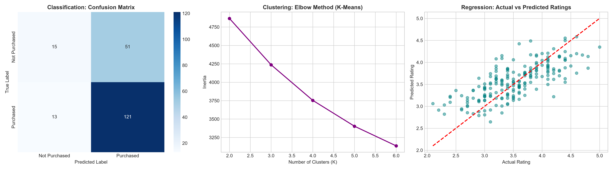

# Multi-Algorithm Recommendation System Comparison

An e-commerce recommendation engine that combines **Regression**, **Classification**, and **Clustering** to analyze user behavior, predict ratings, estimate purchase intent, and segment customers.

---

## 📌 Features & Architecture

* **Rating Prediction (Regression):** Built using **Ridge Regression** (`alpha` tuned via `GridSearchCV`) to predict product ratings ($1.0 - 5.0$).
* **Purchase Intent Prediction (Classification):** Built using **Logistic Regression** to predict whether a user will purchase an item ($0/1$).
* **Customer Behavioral Segmentation (Clustering):** Grouped user profiles using **K-Means Clustering** based on view count, dwell time, cart additions, and total spend.

---

## 📊 Performance Comparison

| Task | Algorithm | Target / Purpose | Key Metrics | Performance Output | Business Impact |
| :--- | :--- | :--- | :--- | :--- | :--- |
| **Regression** | Ridge Regression | Predict Product Rating | MAE, RMSE, R² | **R²: 0.53, RMSE: 0.39** | Surface top-rated items to users |
| **Classification** | Logistic Regression | Predict Purchase Likelihood | Accuracy, F1 Score | **Acc: 0.68, F1: 0.79** | Trigger real-time cart-abandonment offers |
| **Clustering** | K-Means | Segment Customers | Silhouette Score | **K=6, Sil: 0.19** | Personalize marketing strategies per tier |

---

## 📈 Visualizations & Model Evaluation

* **Confusion Matrix:** Evaluates classification accuracy for predicting high-intent shoppers.
* **Elbow Curve:** Identifies the optimal cluster count ($K=6$) for user behavior profiling.
* **Actual vs Predicted Ratings:** Shows prediction accuracy for expected product ratings.
